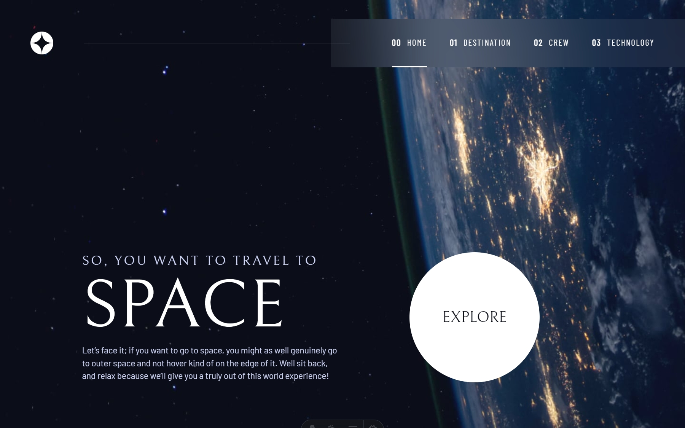

# Frontend Mentor - Space tourism website solution

This is a solution to the [Space tourism website challenge on Frontend Mentor](https://www.frontendmentor.io/challenges/space-tourism-multipage-website-gRWj1URZ3). Frontend Mentor challenges help you improve your coding skills by building realistic projects.

## Table of contents

- [Overview](#overview)
  - [The challenge](#the-challenge)
  - [Screenshot](#screenshot)
  - [Links](#links)
- [My process](#my-process)
  - [Built with](#built-with)
  - [What I learned](#what-i-learned)
  - [Continued development](#continued-development)
  - [Useful resources](#useful-resources)
- [Author](#author)
- [Acknowledgments](#acknowledgments)

## Overview

### The challenge

Users should be able to:

- View the optimal layout for each of the website's pages depending on their device's screen size
- See hover states for all interactive elements on the page
- View each page and be able to toggle between the tabs to see new information

### Screenshot

### Links

- Solution URL: [GitHub repo](https://github.com/kaamiik/fm-Space-Tourism-Website-using-astro-sass-tailwind)
- Live Site URL: [Add live site URL here](https://fm-space-tourism-website-using-astro-sass-tailwind.vercel.app/)

## My process

### Built with

- Semantic HTML5 markup
- CSS custom properties
- Flexbox
- CSS Grid
- Mobile-first workflow
- Tailwind
- Astro
- Sass/Scss

### What I learned

I learned to build a multipage website with losts of information on each page. There is a homepage and three other pages that give you some information about space. It was really challeenging to build navigation on the header of the site. There is a hamburger menu on mobile and on desktop There was some challenges to make the style like the design. I tried my best on this.

Also each page has a tab system that you should handle both CSS and JS for this. It was so challenging too.

### Useful resources

- [Scrimba/Kevin Powell Space Tourism Challenge](https://scrimba.com/build-a-space-travel-website-c014) - This helped me for deployment of this website. I really tried to learn from this course and not just copy and paste some code.

## Author

- Frontend Mentor - [@kaamiik](https://www.frontendmentor.io/profile/kaamiik)
- X - [@kiaakamran](https://www.x.com/kiaakamran)
